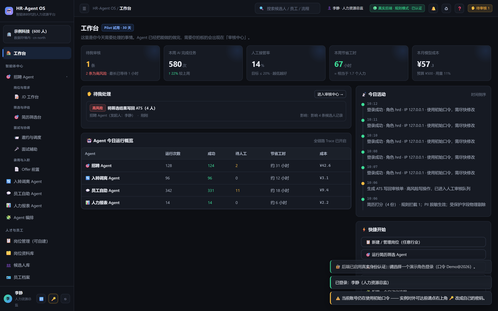
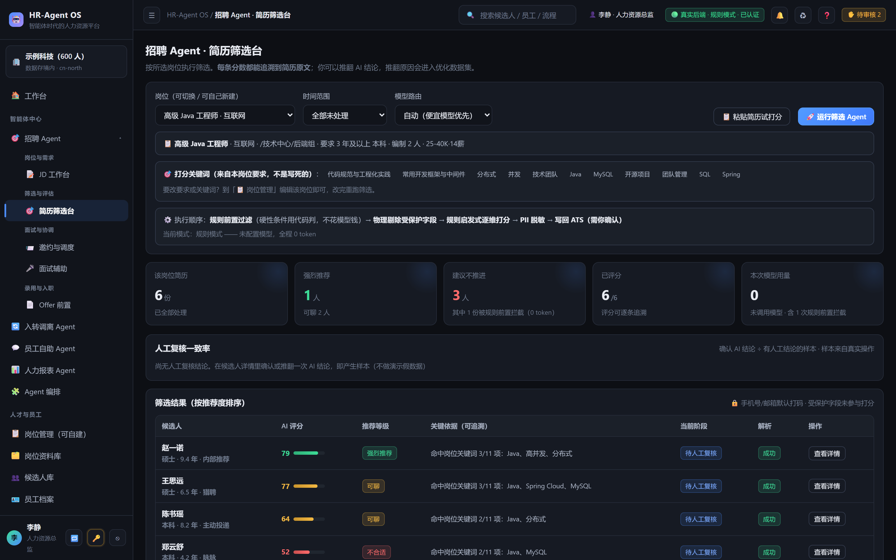
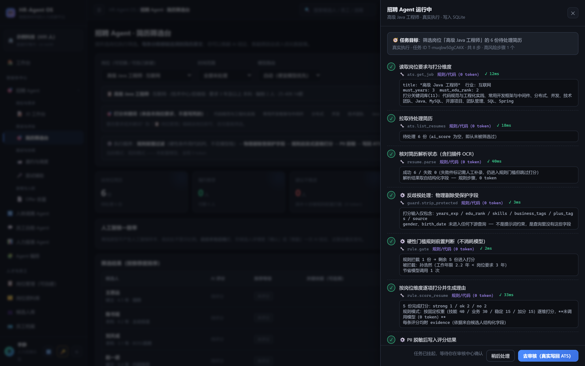
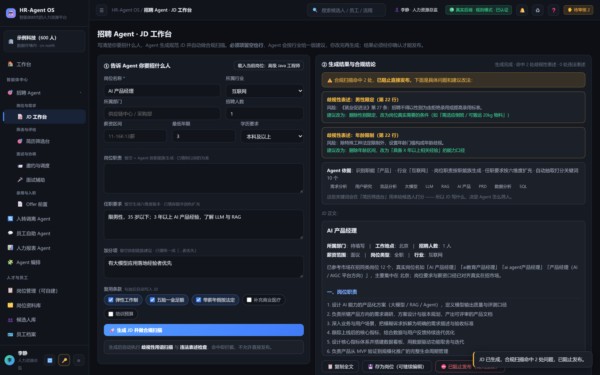
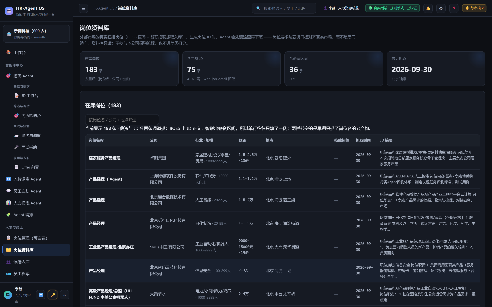
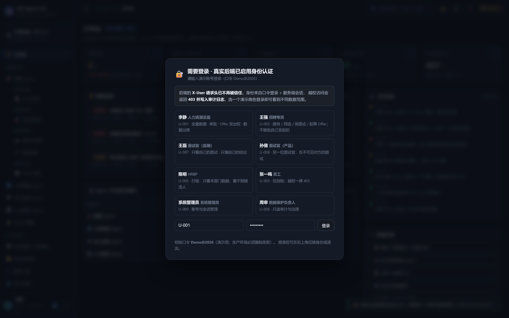

# HR-Agent OS

**一个能真跑起来的 B 端 HR AI Agent 平台 PoC。运行时零依赖**（Node 22 原生 `http` + 内置 `node:sqlite`，`dependencies` 为空）—— clone 下来一条命令就能起，不需要装任何 npm 包。

[](https://github.com/myc20050802-debug/hr-agent-os/actions/workflows/test.yml)
[](https://github.com/myc20050802-debug/hr-agent-os/actions/workflows/pages.yml)
[](LICENSE)
[](package.json)
[](#技术选型为什么是零依赖)

这不是「界面长得像 HR 系统」的静态原型。界面上的**每一个分数都能回答「为什么是这个分」**，
每一次越权都在**服务端**被 403 拦下，每一份 JD 都会先对着真实在招市场做一次校准、再做一遍用工合规扫描。
更关键的是：**这些结论全部可复现 —— 不接大模型也能跑通全流程。**

| | |
|---|---|
| 🔍 **在线 demo**（零安装，点开就玩） | **https://myc20050802-debug.github.io/hr-agent-os/**（GitHub Pages）<br>**https://hr-agent-os.app.workbuddy.host/**（备用预览，现在就能点） |
| ⚡ **本地跑起来**（真 SQLite + Agent 引擎 + 权限拦截） | `npm run dev` → http://127.0.0.1:8788 |

<p align="center">
  
  
</p>
<p align="center">
  
  
</p>
<p align="center">
  
  
</p>

> 截图全部由 `tools/shoot_readme.py`（Playwright）**真跑一遍核心流程**后拍摄：
> 先登录、真的运行一次筛选 Agent、真的生成一份带违规表述的 JD。
> 不是摆拍的空壳界面 —— 所以图里能看到真实分数、真实合规结论、真实市场数据。

---

## 它和「HR 系统的演示原型」不一样在哪

| # | 能力 | 为什么它是真的（不是话术） |
|---|---|---|
| 1 | **分数可解释** | 每个分数下面有一栏「为什么是这个分」：逐维算式（`技能匹配 40 × 0.95 = 38`）＋决定性因素＋还差几分进下一档。归因**只读**打分时已算出的系数、不做二次计算，测试里锁死「分项之和 == 总分」「满分 × 系数 == 该维得分」。 |
| 2 | **规则与模型分工明确** | 分数与档位 **100% 由确定性规则算出**（0 token、可复现、可追溯、可签字）；模型只做三件事：推荐理由的**措辞**、制度问答的语言组织、JD 润色。所以「不配大模型也能跑通全流程」不是降级方案，是设计选择。对照评测见 [`docs/16`](docs/16_规则与LLM双模式对照评测.md)。 |
| 3 | **权限真的在服务端** | 24 个能力 × 7 个角色 ＋ 行级数据范围（`all/dept/self`）＋ PII 字段脱敏，**全部在出数据之前生效**。员工身份导出全公司花名册是**真 403**（缺 `employee:export` 能力），前端按钮显隐只是体验层。 |
| 4 | **审计改不掉** | 应用层只插不改，外加迁移 v4 建的 `BEFORE UPDATE` / `BEFORE DELETE` 触发器 `RAISE(ABORT)` —— 想改审计得先改 schema，而 schema 是版本化迁移管的。 |
| 5 | **JD 接地真实市场 ＋ 合规红线** | 生成前先按「标题优先」检索市场在招同类岗位（仓库自带 183 条抓取快照），拼接前做最长公共子串 + bigram 双去重；命中「限男性」「35 岁以下」这类表述**直接阻止发布**，每条给法条依据与建议改法（见上图右下）。 |

---

## 先看一眼（零安装 · 30 秒）

**在线 demo**：**https://myc20050802-debug.github.io/hr-agent-os/**（GitHub Pages）· **https://hr-agent-os.app.workbuddy.host/**（备用预览，现在就能点）

为什么它能免安装：`平台原型/index.html` 是**完全自包含的单文件** —— 内联了全部样式与脚本，
`<script src=` / `<link href=` 均 0 命中（`.github/workflows/pages.yml` 里有一条断言专门卡这件事）。
所以它天生就是静态站点：不用 clone、不用装 Node、不用登录，打开就是 **24 个页面全部可点**，
数据是内置演示数据（页面顶部会明确标注「在线预览 · 离线模式」，不假装连着后端）。

要真实 SQLite 持久化、Agent 引擎、权限拦截这些**需要后端**的能力，仍需按下一节本地启动。

> ⚠️ 离线演示态用的是**内置演示数据**，所以「岗位资料库」页在静态托管下是空的
> （那 183 条市场岗位存在服务端 SQLite 里）。想看满血版就本地跑，或直接看上面的截图。

---

## 一分钟跑起来

```bash
npm run dev        # 幂等：已在跑就直接返回，不会起第二个实例
# 打开 http://127.0.0.1:8788
```

等价的手工方式：`cd server && node --experimental-sqlite server.js`。
Windows 双击 `server/start.bat` 即可（自动开浏览器）。
要求 Node 22+（用到内置 `node:sqlite`）。

**第一次打开会让你登录**（v0.10.0 起后端启用了真实身份认证，默认 `strict` 模式）。登录页列了 8 个演示账号（含 2 位**面试官**），**统一口令见登录页的「演示账号」提示栏**——口令刻意不打印到控制台/日志（stdout 常被重定向进文件，写口令等于发凭证）。
不想登录？加 `?offline=1`（或 `#offline`）走**离线演示态**（不发任何网络请求，全功能可点）。

想从干净数据开始：`node --experimental-sqlite server.js --reset`
（`--reset` 会连库一起重建；也可以直接删掉 `server/hr_agent.db` 后重启——空库会自动跑迁移并重新种子。）

### 不管从哪儿打开，都自动进在线模式

过去原型有三种打开方式，**只有第一种是在线的**，另外两种会静默落回离线演示 ——
「怎么又是离线模式」就是这个。现在三条路都收口了：

| 打开方式 | 过去 | 现在 |
|---|---|---|
| 后端托管 `http://127.0.0.1:8788/` | 在线 | 在线（同源，行为不变） |
| 双击 `平台原型/index.html`（`file://`） | 离线 | 探测到本机后端 → **自动跳转到 8788**，进入在线模式 |
| WorkBuddy 预览面板（`http://127.0.0.1:<随机端口>`，跨源） | 离线 | **跨源直连** 8788（不跳转 —— 后端带 `X-Frame-Options: SAMEORIGIN`，跳过去会白屏） |

两种机制支撑它：

1. **项目级 SessionStart hook**（`.workbuddy/settings.json`）—— 每次打开这个项目就调
   `tools/dev-up.sh` → `tools/dev-up.js`，**幂等**地把后端拉起来（已在跑就什么都不做）。
   顺手还会比对 `schema` 版本：**在跑的实例比代码旧时会明确告警**，
   避免「连是连上了，但连的是个缺列的旧进程」这种更难查的故障。
   启动方式在 Windows 上走 WMI（`Win32_Process.Create` + `-WindowStyle Hidden`）——
   实测宿主的 Job Object 会把普通 `spawn(detached)` 的子进程一起回收，而 WMI 创建的进程不在其中。
2. **前端自动找后端**（`平台原型/src/app.js`）—— 先探当前源，失败再探 `127.0.0.1:8788`，
   探到就切过去。左下角有一条**连接状态条**，只在「没连上」或「跨源连上了」时出现，
   离线时会**按宿主给不同的话**：本机打开 → 引导「双击 `server/start.bat`」+「重试连接」；
   静态托管的访客（如 GitHub Pages）→ 说明「这是在线预览 · 离线模式，这里没有后端」，
   而不是让他去找一个自己本机并不存在的文件。这段分流有专门用例锁着：`npm run test:pages`。

验证这条链路：`npm run test:devup`（幂等启动 / CORS 白名单 / hook 接线 / 预览面板跨源场景）。
后端已经在跑但版本旧了：`npm run dev:restart`。

---

## 交付物

| 文件 | 是什么 |
|---|---|
| `平台原型/index.html` | **可点击平台原型**，单文件 **535,804 bytes（约 523KB）**，24 个页面，双击即开（探测到本机后端会自动切到在线） |
| `server/` | **真实后端**：Node 原生 HTTP + SQLite + Agent 引擎，零依赖；**16 个模块按 L0–L5 分层** |
| `shared/` | **前后端共用的单一数据源**：`req-lib.js`（职能族词库）/ `override-codes.js`（推翻原因枚举）/ `score-why.js`（打分归因与系数阶梯）。只改这里，离线端与后端同时生效 |
| `.workbuddy/settings.json` | **项目级 hook**：SessionStart → `tools/dev-up.sh`，每次打开项目把后端幂等拉起 |
| `tools/dev-up.js` / `tools/dev-up.sh` | **幂等启动器**：已在跑就不重复启；比 `schema` 版本、检陈旧实例；Windows 走 WMI 让进程活过宿主回收 |
| `tools/golden/golden_set.json` | **人工标注黄金集**：3 个岗位 × 10 份简历 = 30 例，含人工档位标签与决定性因素说明 |
| `tools/test_eval.js` | **筛选质量评测**：档位一致率 / ±1 档一致率 / 漏筛率 / 误筛率（与线上同一份 `evaluateCandidate`） |
| `tools/test_load.js` | **并发压测**：读 / 写 / 读写混合三阶段，输出 P50 / P90 / P95 / P99 与吞吐 |
| `tools/test_devup.js` | **「打开即在线」链路验收**：幂等启动 / CORS 白名单 / hook 接线 / 预览面板跨源场景 |
| `tools/run_all.js` | **一键回归**：拉起隔离实例（独立端口 + 临时库）跑全部套件，不碰演示数据 |
| `tools/preflight.js` | **上线前自检**（`npm run preflight`，只读）：口令强度 / `COOKIE_SECURE` 与访问协议是否配对 / `ALLOW_RESET` / 库路径 / 备份新鲜度 —— 退出码 0 才可以把链接发出去 |
| `tools/backup.js` | **在线备份与恢复**（`npm run backup`）：SQLite `VACUUM INTO` 只读快照，不停服、不阻塞写者；带 `integrity_check`、SHA-256 清单、保留策略，恢复前强制停服 |
| `tools/test_ops.js` | **运维面回归**（48 项）：静态资源 gzip/ETag/源码隔离/目录穿越、CORS 预检头对齐、重置开关、口令治理、备份恢复与保留策略 |
| `docs/01_产品需求草稿PRD.md` | 七部分 PRD 草稿（定位 / 架构 / 模块 / 底座 / 合规 / MVP / 菜单） |
| `docs/02_搭建实操教程.md` | 8 阶段落地教程（含建表 SQL、工具注册中心、闸门代码） |
| `docs/03_本地全栈版运行说明.md` | 眼前这套代码怎么启动、怎么验证、怎么接模型、已知边界 |
| `docs/04_产品复盘_从0到1怎么做出来的.md` | 从 0 到 1 的完整产品复盘（8 阶段 + 20 条决策速查表 + 面试口径） |
| `docs/05_从PoC到企业级的差距清单.md` | **离企业级还差什么**：8 项差距按 P0/P1/P2 分级 + 改法 + 验收口径 + 面试口径 |
| `docs/06_JD素材扩充清单.md` | **JD 为什么"片面"以及怎么补**：职能族职责池扩充清单 + 行业语境词表（已并入 `shared/req-lib.js`：30 族 242 句） |
| `docs/07_项目计划书.md` | **按真实产品标准的项目计划**：目标形态 / 范围与非目标 / GitHub 对标 / M0–M5 里程碑 / 拍板结果 |
| `docs/08_架构设计文档.md` | **目标架构分层（L0–L5）+ 10 条 ADR**：权限模型 / AI 能力层 / 迁移路径 / 选型对照 |
| `docs/09_实现说明与验收报告.md` | **M1「可信底座」做了什么、凭什么说做完了、还差什么**：关键决策 9 条 + 异常处理清单 + 三套回归证据 + 4 条被测试抓出的真实缺陷 |
| `docs/10_招聘Agent目录与模块组织结构.md` | 三级导航 IA（分组 → 目录 → 模块 → 页）与「新增一个 Agent」checklist |
| `docs/11_从PoC到可用软件的落地路径.md` | **「可用」的三个档位**（演示可达 / 团队可用 / 对外可卖）与各自的真实差距 |
| `docs/12_上线部署手册_A档.md` | **A 档上线手册**：`preflight` 每项检查在防什么 + 三条发布路径 + 上线前必做四件事 + 验收清单 |
| `docs/html/上线部署手册_A档.html` | `docs/12` 的暗色单文件阅读版（可搜索） |
| `docs/html/HR-AI-Agent平台_产品方案.html` | `docs/01` + `docs/02` + `docs/03` 合并的暗色单文件阅读版（可搜索、可复制代码） |
| `docs/html/HR-AI-Agent平台_项目计划与架构.html` | `docs/07` + `docs/08` 的暗色单文件阅读版（双文档 Tab 切换 · 可搜索） |
| `docs/html/` | **全部文档的暗色单文件阅读版**（生成物，勿手改）：`docs/` 里的 md 改完，用 `tools/md2dark_html.py` 重新生成 |

> ⚠️ `分享包/` 里的离线演示包是 **M1 之前的版本**（无登录层），口令与身份相关的演示路径以本仓库最新版为准。

**岗位库驱动（v0.9.1 起）**：平台里不写死任何岗位。HR 可以自己新建 / 编辑岗位（岗位名、行业、部门、年限、学历、必须项、加分项、JD 全可填），系统据此**自动抽取打分关键词**，并驱动筛选 Agent 的硬性门槛与打分依据、以及 JD 合规扫描。内置 **30 个职能族 + 18 类行业词库、17 个行业 21 个种子岗位**，新建岗位会自动生成 5 份演示简历，建完即可跑筛选。

**职能族优先（v0.9.3 起）**：抽词不再只看「行业」。以前是「互联网行业」的岗位一律补 Java/Spring，导致**产品经理、设计师也被塞进技术栈**。现在先识别**职能族**（30 族：技术 / 产品 / 设计 / 数据 / 运营 / 市场 / 销售 / 实施交付 / HR / 财务 / 风控合规 / 供应链 / 生产 / 工程设备 / 工艺 / 质量 / 医疗 / 客服 / 零售门店 / 行政 / 法务合规 / 教育培训 / 建筑工程 / 传媒内容 / 物流运输 / 酒店餐饮 / 物业安保 / 医药健康 / 游戏 / 能源电力），命中就用该职能的技能库，**识别不到才回落行业库**。所以「AI 产品经理（互联网）」拿到的是需求分析 / PRD / 模型评测，而不是 Java。词库只有一份（`shared/req-lib.js`），前后端同源；老 JD 靠 `jd_ver` 版本号在启动时自动重算洗一遍，误填的跨职能技能由 `stripMisfitAutoFill()` 清掉。

**职能族细分（v0.9.5 起）**：把三组「天天在打交道、但每天做的事完全不同」的岗位从大类里拆出来，各建独立族 —— **风控合规**（从财务法务拆出：财务管「钱怎么记」，风控管「钱能不能放」）、**工艺工程**（从工程设备拆出：设备管「机器修得好不好」，工艺管「活怎么干最省」）、**零售门店**（从运营拆出：门店管「人、货、场」，线上运营管「分层、内容、投放」）。拆分前「风控专员」会被补上「账务核算与财务报表编制」、「工艺工程师（IE）」会被补上「设备点检与预防性维护」、「门店店长」会被补上「内容规划与渠道投放」。词库仍只有一份，并严格遵循「**一个识别词只属于一个族**」。

**职能族扩充 + JD 子方向选取（v0.9.6 起）**：一次把职能族从 **20 扩到 30**（新增法务合规 / 教育培训 / 建筑工程 / 传媒内容 / 物流运输 / 酒店餐饮 / 物业安保 / 医药健康 / 游戏 / 能源电力），每族职责池从 **4 条补到 8 条**（产品族 10 条），全平台 **242 句**；同时给每句职责打**子方向标签**，新增 `ReqLib.pickDuties()` —— 生成 JD 时按岗位名与要求里的子方向词**择优挑 6 条**（命中优先、其余兜底）。于是**同族不同岗不再一字不差**（如「AI 产品经理」取 AI / 数据向句子，「B 端产品经理」取商业化向句子），全程无模型、结果可复现。另给技术族加了 `weak: ['运维']` 弱关键词机制：「光伏运维工程师」靠强词「光伏」归能源电力族，纯「运维工程师」才归技术族。

**岗位层级自适应（v0.9.4 起）**：岗位名或要求里出现「管培生 / 实习生 / 应届 / 校招 / 储备干部」时，自动把「工作经验」维度从「N 年以上」换成 **「无需相关工作经验，欢迎应届毕业生投递 + 有 1–2 段对口实习经历者优先」**，筛选 Agent 的年限门槛同步放开——避免出现「JD 写着欢迎应届生、门槛却把应届生全拦掉」的自相矛盾。

**行业语境词接回 JD 正文（v0.9.7 起）**：职能族决定「这个人每天做什么」，行业决定「在什么赛道做、盯什么指标、说什么行话」。新增 `INDUSTRY_CTX`（17 个行业），生成 JD 时在职能职责之后补一句**行业口径句**，如「以 DAU、留存与转化漏斗为核心指标，结合埋点与 A/B 实验验证迭代效果」（互联网）、「以发电量、可利用率与度电成本为考核口径，落实两票三制与并网技术监督要求」（能源电力）。拼入前先与已选职责做**最长公共子串 + bigram 重合度**双重去重，避免同一件事说两遍。于是**同一职能族落在不同行业，JD 也不一样**，老问题「行业维度被丢弃」被补回。

**任职要求六维度扩充（v0.9.2 起）**：任职要求不再是一条干巴巴的要求。在「岗位管理」或「JD 工作台」里**只填一条**（如「3 年以上采购经验，熟悉供应商开发与成本管控」），Agent 会把你填的那条**原样保留**，再按 **专业技能 / 工作经验 / 学历背景 / 综合素质 / 软技能** 五个维度补齐（含职能化表述与对口专业方向），加分项同步扩充。1 条输入 → 5 维度 13 条输出。

**行业兜底口径（v0.9.9 起）**：**只有认出职能族，才允许用行业素材补位。** 行业技能库是按「该行业的主力职能」写的 —— `INDUSTRY_SKILLS['互联网'].core` 整份是 Java / Spring Boot / MySQL，医疗健康那份整份是护理管理 / 院感控制。所以「认不出职能就退回行业库」这条老兜底，会把**储备干部补成程序员、把城市经理补成护士长**。现在改为：认出职能 → 用职能族；**认不出 → 一律不补专业技能硬技能与加分项，其余维度退回「通用」中性口径**。行业维度没有被丢掉 —— 它对 JD 的正当贡献是 `INDUSTRY_CTX` 那句「在什么赛道做、盯什么指标、说什么行话」（见上），与「补什么技能」是两条独立路径。

**排版（v0.9.8 起）**：任职要求与加分项按**自然行文段落**输出 —— 维度名做小标题，正文是「；」衔接的一整段话，不再逐条编号。整段粘贴进来的一份完整 JD 会先做**原文还原**：剥掉行首残留符号（`·` `•` `1.` `①`）、把被硬回车切开的断行合并回完整句子，再按「你会做什么 / 我们想找这样的你 / 有这些更香」这类小标题把内容分到 职责／任职要求／加分项。**条目边界只由「换行」和「行首符号」决定，逗号与分号是句中标点、不是分隔符** —— 这是「一份 JD 被切成 20 条碎片」的根因。

---

## M1 · 可信底座（v0.10.0 起）

这一版把项目从「能演示的 PoC」推进到「可信、可运维、可审计」。**改的是一件事：身份不能再由客户端说了算。**

| 能力 | 一句话 | 关键实现 |
|---|---|---|
| **真身份** | 登录拿会话，不再有可伪造的请求头 | 口令 `scrypt` 哈希（Node 内置，零依赖）；**服务端 `sessions` 表 + 可吊销令牌**；HMAC 签名 + 指纹校验；连续失败 5 次锁定；改密吊销全部会话 |
| **三层权限** | 功能级 × 行级 × 字段级 | 24 个能力 × 7 个角色（默认最小权限）＋ 数据范围 `all/dept/self`（部门按路径前缀）＋ PII 字段脱敏；**全部在服务端出数据之前生效**。面试官是独立角色：只能读写**属于自己的那场面试** |
| **审计不可篡改** | 应用层只插不改 **+ 数据库触发器物理拒绝** | 迁移 v4 建 `BEFORE UPDATE` / `BEFORE DELETE` 触发器，`RAISE(ABORT)`；403 写留痕，401 不写（否则淹没情报） |
| **PIPL 数据治理** | 不是声明，是逻辑 | 留存策略（带法条依据）+ 授权留痕/撤销 + 到期巡检自动匿名化 + 删除权（匿名化/物理删除）+ 主体数据导出 |
| **版本化迁移** | 空库一键建到最新 | `schema_migrations` + v1–v7 顺序迁移；实测重启后 `schemaVersion: 7`、19 表、2 触发器 |
| **招聘链路闭环** | 「已邀约」之后不再是断路 | 迁移 v5 建 `interviews` / `offers` 表；状态机**只有一份**（`server/hiring.js`）；Offer 合规**代码级红线**（最低工资 2420 / 试用期 6 个月，违反直接 422 阻断且不落库）；**起草人不能批自己起草的 Offer** |
| **可运维** | 出事能定位 | 统一错误契约（10 个 code）+ `requestId` 全链路 + 结构化 JSON 日志（敏感字段自动 `[REDACTED]`）+ 令牌桶限流 + 指标分位 + 优雅关闭 |

**关键取舍（面试常问）**：
- 用**服务端会话**而不是纯 JWT —— 因为 JWT 无法吊销，人离职了也踢不下线。
- **匿名化优先于物理删除** —— 删掉整个人会断掉审计链，劳动争议举证时需要「曾被评估过」这个事实。
- **本轮没换 PostgreSQL** —— 换库风险高，而且**不降低企业级门槛**；先把可信补上（完整理由见 `docs/09` §二 D1）。

---

## 打分可解释：每个分数都要能回答「为什么」

界面上的**每一个分数**下面都必须有一栏「为什么是这个分」。这一栏不是文案，是算术：

```
为什么是 64 分
38 + 6 + 12 + 8 = 64        ← 逐维满分 × 达成系数，可逐位核对
  技能匹配  40 × 0.95 = 38   命中 2/2 个岗位关键词（全部命中）
  业务匹配  30 × 0.2  = 6    未命中任何产品类业务标签 → 触底系数
  稳定性    15 × 0.8  = 12   岗位未设年限门槛 → 固定 0.8（不是简历没写好，是岗位没提年限）
  加分项    15 × 0.55 = 8    命中 1 个：一等奖
决定性因素  技能匹配拿到 38/40，占总分 59% —— 这份分数主要靠它撑住
            业务匹配丢了 24 分（6/30）—— 这是它没往上走一档的主因
档位        「可聊」（60–77）。还差 14 分到「强烈推荐」（78 分起）
再往前一步   补 2 个产品类业务标签（如 SaaS、B 端产品、C 端产品）
            → 业务匹配 6 → 22（+16 分）→ 总分约 80，进「强烈推荐」
置信度：偏低  岗位要求只识别出 2 个关键词，技能维度命中 2 个就封顶 —— 样本越少，这一维越不具区分度
```

四条设计纪律（写在 `shared/score-why.js` 头部，改之前先读）：

1. **归因不许引入新权重** —— `explain()` 只读打分时已经算出的系数，不做二次计算。
   否则它迟早会算出和总分不一致的结论。测试里锁死了 `为什么分之和 == 实际分数`、`满分 × 系数 == 该维得分`。
2. **系数阶梯只有一份** —— `shared/score-why.js` 的 `LADDERS`，后端 `scoreOne` 与离线 `scoreResume` 都从这里取。
   改一处忘一处，两侧的「为什么」就会开始说两套话。
3. **不许编不存在的证据** —— 文案里的每个数字（命中几项、差几个标签、还差几分）都由入参算出。
   关键词一个都没抽出来时，宁可说「本题没法用多命中来提分」，也不编具体词。
4. **归因落库** —— 存进 `candidates.ai_why`（迁移 v7）。它是**当时那次判断的原始记录**；
   岗位关键词会随词库升级重算，读取时已拿不全当时的命中明细。
   老数据（v7 之前给的分数）没有落库归因，前端用已存的四维分数现推一份，并显式标注「归因来源」——
   宁可解释得粗一点，也不留「只有分数没有原因」的空档。

覆盖范围：**试打分抽屉**（完整归因块）、**候选人详情**（完整归因块）、**列表里的分数**（悬停给一句话归因）。
`shared/score-why.js` 与 `shared/req-lib.js`、`shared/override-codes.js` 一样前后端共用单一来源。

---

## 两种运行模式

同一份 `index.html`，两种状态：

- **离线演示态**：直接双击打开。内置假数据，24 页全可点，适合演示信息架构与交互。**不发任何网络请求**，断网可用。
- **真实后端态**：由 `server.js` 托管（访问 `http://127.0.0.1:8788`）。页面先探测后端，`strict` 模式下弹出**登录闸门**；登录后右上角亮「🟢 真实后端 · SQLite · 已认证」，此后：
  - 筛选 Agent 的打分**真的写进数据库**；
  - 高风险写操作**真的被闸门拦下**，生成真实审批单；
  - 批准 / 驳回**真的改变数据**并写审计日志；
  - 员工身份导出全公司数据**真的返回 403**（**用当前会话真请求，不再伪造请求头**），且这次尝试被记进审计；
  - 新建 / 编辑 / 关闭岗位**真的写库**，并即时影响筛选台与 JD 工作台；
  - **导航按能力裁剪**：员工登录后不会看到一堆「点进去全是 403」的菜单（这层只是界面减负，**安全由服务端保证**）。

---

## 五分钟演示路径

> 访问 `http://127.0.0.1:8788` 时先**登录**（默认 HRD 视角用 `U-001 李静`，口令见登录页提示）。左下角 🔁 可切换演示身份、⎋ 登出。

0. **岗位管理** → 看 21 个岗位覆盖 17 个行业 → 找到「AI 产品经理」（互联网），确认它的打分关键词是产品词、没有 Java（对比「高级 Java 工程师」）→ 再点开「光伏运维工程师」（能源电力）：职责首条是「光伏／风电／储能项目」而不是「线上服务稳定性」，证明职能识别走的是「能源电力」而不是「技术」→ 「➕ 新建岗位」，填任意岗位（如「供应链采购专员 / 制造业」）→ 保存后自动生成 5 份演示简历。
1. **简历筛选台** → 切到刚建的岗位：打分关键词、KPI、候选人列表**全部跟着岗位变** → 运行 Agent：8 步计划逐步展开，第 4 步物理剔除受保护字段，第 5 步用规则（0 token）前置拦截，第 8 步停在人工闸门。
2. **审核中心** → 批准：真实变更候选人阶段，提示实际变更条数。
3. **驳回** → 不填原因被拦下；填了才放行，原因进入优化数据集。
4. **JD 工作台** → 岗位名 / 行业自由填，必须项故意写「限男性，35 岁以下」→ 命中并**阻止发布**，每条给法条依据与建议改法 → 「存为岗位」可一键变成真岗位。
5. **只看一条要求会怎样** → 只写「3 年以上采购经验」→ 任职要求自动变成 5 个维度 13 条，原句保留。
6. **员工自助** → 问「我还有几天年假」查的是 HR 系统；问「查同事的年假」明确拒答。
7. **风险拦截记录** → 点「以员工身份导出全公司花名册」：**当前身份（HRD）会被放行** → 点「切换到员工身份重试」→ **真 403**（提示缺 `employee:export` 能力），并说明这次失败尝试已写入审计。
8. **操作审计日志** → 刚才那条 403 就在里面（`result = blocked`，`detail` 以「被拦截：」开头）→ 顺带看该页的说明：审计由**数据库触发器**保证 append-only，改不动也删不掉。
9. 左下角 **♻** → 一键回到初始状态，可反复演示。

---

## 技术选型（为什么是零依赖）

| 层 | 选型 | 理由 |
|---|---|---|
| 后端 | Node 22 原生 `http` | 装不动 npm 也能跑；依赖越少越容易交给客户 IT |
| 数据库 | `node:sqlite` | 单文件、可拷走、可 `git` 外；演示态零运维 |
| 前端 | 内联单文件 HTML | 双击即开，也能被后端直接托管 |
| 模型 | 可插拔网关（默认规则模式） | 未配 `LLM_API_URL` 时全用确定性规则，**离线可跑、结果可复现**；配了就走任意 OpenAI 兼容接口，失败自动回退 |

接模型：

```bash
$env:LLM_API_URL="https://your-endpoint/v1/chat/completions"
$env:LLM_API_KEY="sk-xxx"
$env:LLM_MODEL="your-model"
node --experimental-sqlite server.js
```

---

## 测试

一键跑全部（**推荐**）：起一个隔离实例（`127.0.0.1:8799` + 临时库），演示库 `server/hr_agent.db` 毫发无伤。

```bash
node tools/run_all.js                 # 功能回归：12 套件
node tools/run_all.js --only backend  # 只跑后端 4 套件（也可用套件 id：--only eval / --only auth）
node tools/run_all.js --only load     # 并发压测（单独一档，不混进默认回归）
node tools/check_docs.js              # 文档守卫：页面数 / 原型字节数 是否与代码一致（已并入 npm test）
```

> `--only` 打错字时**会报错退出**，而不是静默跑 0 套件假装通过 —— 假绿比红灯更贵。
> 同理，**只要有套件没跑**（例如缺 `jsdom`），运行器就打印「结论不完整」并以 **退出码 4** 结束：
> 没跑过的套件不允许被算作通过。这条行为由 `tools/test_runner.js` 自己锁着，且做过反向验证。

单套件（`--experimental-sqlite` 是因为要 require 服务端模块；`test_hiring` / `test_live` 需先启动 server）：

```bash
node --experimental-sqlite tools/test_auth.js        # 可信底座 · 鉴权 / 权限 / 迁移 / 错误契约
node --experimental-sqlite tools/test_hiring.js      # 招聘链路 · 状态机 / 合规闸门 / 行级隔离
node --experimental-sqlite tools/test_jd.js          # JD 生成口径 · 原文还原 / 段落化 / 往返无损
node --experimental-sqlite tools/test_eval.js        # 筛选质量评测 · 黄金集 + 一致率接口 · 56 项
node --experimental-sqlite tools/eval_dual_mode.js   # 规则 × LLM 双模式对照 · 分工证据 + Wilson 95% 区间（已并入 npm test）
node --experimental-sqlite tools/test_screening.js   # 用量真实性 / 可重复运行 · 29 项
node tools/test_devup.js                             # 打开即在线 · 幂等启动 / CORS / hook 接线 / 跨源场景 · 18 项
node --experimental-sqlite tools/test_ops.js         # 运维面 · gzip / ETag / 源码隔离 / 重置开关 / 口令治理 / 备份 · 48 项
npm run preflight                                    # 上线前自检（只读；退出码 0 才可以把链接发出去）
npm run backup                                       # 在线备份（VACUUM INTO 快照，不用停服）
cd 平台原型
node test_prototype.js                               # 离线：24 页渲染 + 23 项交互（无需 server）
node test_pages.js                                   # Pages 静态托管：自包含断言 / 宿主提示分流 / 离线渲染
node test_live.js                                    # 真后端：24 页渲染 + 27 项真链路（需先启动 server）
```

当前状态：**全部 0 失败 · 12 套件全绿**（后端 4 + 自包含 4 + 前端 4）。压测另跑，0 错误。

> 运行前端无头测试需要 `jsdom`：`NODE_PATH=<你的 workspace>/node_modules node test_live.js`（本项目自身不依赖任何 npm 包）。
> 硬验证：删掉 `server/hr_agent.db` 后重启，空库自动跑到 `schemaVersion: 9`（20 张业务表 / 2 个触发器 / 23 个索引），无需人工干预。

> CI 在 **Node 22 与 24** 上各跑一遍（`fail-fast: false`）。只测一个版本，就看不见「上游 Node 升级后本仓库悄悄坏掉」这类问题 —— 本项目真踩过一次（Node ≥24 的 undici 会拒收跨 realm 的 `AbortSignal`），详见 `CHANGELOG.md`。

---

## 质量与性能实测（数字都是跑出来的）

**筛选质量**（`tools/golden/golden_set.json`，30 例人工标注，3 个岗位各 10 例）：

| 指标 | 数值 | 口径 |
|---|---|---|
| 档位一致率 | **90.0%**（27/30） | AI 档位与人工档位完全相同 |
| ±1 档一致率 | **100.0%**（30/30） | 没有跨两档的硬错 |
| 漏筛率 | **0.0%**（0/18） | **该通过的人被 AI 判 no** ← 安全红线，回归断言 |
| 误筛率 | **25.0%**（3/12） | 该淘汰的人被 AI 判 strong/ok |

3 例分歧全部同向（AI 过宽），且都是**故意埋的边界探针**：前端技术负责人（`JavaScript` 含「Java」字样被误命中）、资深算法工程师（业务/加分标签堆叠抬高分数）、资深销售（沟通类标签全中但无交付经验）。这三条直接对应 `override_code` 枚举里的 `keyword_fuzzy` / `biz_overrated`——**评测不只是打分，它给出了改进清单**。

**打分口径：关键词必须跟着岗位走**（词库在 `shared/req-lib.js`，版本号 `REQ_LIB_VER` 在 `server/engine.js`，当前 **14**）

原型里有个更隐蔽的同类问题：`scoreResume` 曾**写死一份 Java 技术词表**（java/spring/kafka/mysql…），岗位要求只拿来判学历与年限两个闸门。于是任何非 Java 岗位都必然技能匹配 0/40 —— 把一份正文写着 `LLM`、`RAG`、`Agent` 的 AI 产品经理简历，拿去评「了解LLM RAG」的岗位，得到 **16 分 / 不合适**。已改为**关键词一律从岗位硬性要求抽**，四个维度的映射口径与后端 `scoreOne` 对齐，界面并把抽到的关键词显示出来（分数可解释）。

同一次排查还修掉了词库层的三个根因：

| 根因 | 症状 | 修法 |
|---|---|---|
| 技能全集只有「能力描述」措辞，没有裸名词 | 「3 年以上 AI 产品经验」只抽得出一个 `AI`；`大模型`/`前端`/`数据库` 全漏 | 新增 `tags` 字段（只进技能全集，**不参与 JD 文案**），已配 tech / product / data 三族 |
| 词库永远追不上新技术词 | 「了解LLM RAG」抽出 `[]` —— `LLM` 词库里根本没有 | 加**拉丁技术名词兜底**（字母开头 ≥2 字符，剔英文虚词） |
| 冗余裁剪把巧合当冗余 | `ue ⊂ vue`、`sql ⊂ mysql` → 留下 `UE` 却裁掉 `Vue` | 裁剪仅跳过「两个词都是纯拉丁」的情形 |

另外把关键词匹配统一到 `ReqLib.kwContains()`：纯拉丁且 ≤3 字符的词要求**词边界**，否则 `email` 会命中 `AI`、`Django` 会命中 `Go`；边界判定用「分隔符→空格」的归一化，否则「Agent、RAG」这种最常见的顿号写法反而漏命中。

自愈：这批改动让 `REQ_LIB_VER` 从 9 升到 11，登录后拉一次快照（`GET /api/bootstrap`）即自动重算全部 21 个岗位的 JD 与关键词，不需要人工逐个改岗位。**评测数字未变**（下表仍是 90.0% / 100% / 0.0% / 25.0%）——说明这次改的是「关键词覆盖」，没有动打分的分档拐点。

**并发性能**（`tools/test_load.js`，单进程 Node，并发 20）：

| 阶段 | n | P50 | P95 | P99 | 吞吐 |
|---|---|---|---|---|---|
| 纯读 | 240 | 22ms | 35ms | 42ms | 822 req/s |
| 纯写 | 40 | 11ms | 12ms | 15ms | 816 req/s |
| 读写混合 | 120 | 24ms | 39ms | 50ms | 779 req/s |

三阶段 0 错误 —— 混合阶段不报错即说明 **WAL 的「读不阻塞写」在实际并发下成立**，而不是一句宣传语。注意这是**单进程单写者**的数字，不代表多实例生产容量；口径与边界见 `docs/05`。

---

## 这不是什么

这是**可运行的产品原型 + 可信底座 PoC**，不是多租户生产级 SaaS。
`docs/03` 第八节列了完整边界（并发、文件存储、集成、知识库、评测、多租户）。
`docs/05` 把「离企业级还差什么」按 P0/P1/P2 分级列全了。

已补上的 P0：**身份认证**、**权限**（M1），以及**离线评测集**（30 例人工标注黄金集 + 一致率 / 漏筛率 / 误筛率）。评测数字与失败模式见上一节，不回避 25% 的误筛率 —— 它说明的是「规则型筛选在标签堆叠面前会偏宽」，而不是「我们做得很好」。

仍然缺的：多租户物理隔离、真实 ATS / 招聘渠道集成、文件与简历原文存储、向量检索、模型评测平台、灰度与回滚。要变成生产系统，按 `docs/02` 的 8 阶段路线推进。

---

## 参与与反馈

- 📋 **[CHANGELOG.md](CHANGELOG.md)** —— 版本演进、每个版本改了什么、为什么改
- 🤝 **[CONTRIBUTING.md](CONTRIBUTING.md)** —— 怎么跑测试、改动的硬约束（改前必读）
- 🔐 **[SECURITY.md](SECURITY.md)** —— 安全边界与漏洞上报方式
- 🐛 **Issue / PR 模板**在 `.github/` 下，按提示填即可

这个仓库最值得看的三份文档：**[`docs/05`](docs/05_从PoC到企业级的差距清单.md)**（离企业级还差什么，按 P0/P1/P2 分级，不回避）、
**[`docs/09`](docs/09_实现说明与验收报告.md)**（凭什么说做完了，含 4 条被测试抓出的真实缺陷）、
**[`docs/16`](docs/16_规则与LLM双模式对照评测.md)**（规则与模型的分工证据 + Wilson 置信区间）。

---

## 许可

**MIT License** —— 可自由使用、修改、分发（含商用），只需保留版权与许可声明。全文见 [LICENSE](LICENSE)。

两点说明：

- 岗位抓取脚本访问的是 BOSS 直聘 / 智联招聘的**公开页面**。请自行确认并遵守目标站点的 robots 与服务条款，不要高频请求。
- 仓库内 `reference_jobs` 里的市场岗位数据为抓取快照，仅用于演示「JD 生成要接地真实市场」这一能力，**不代表任何公司的招聘承诺**。

---

## 生成物说明

根目录下带日期的 `.html` 与 `平台原型/index.html` **都是生成物，不要手改**：

```bash
npm run build                                   # 重新打包前端原型
python tools/md2dark_html.py --out out.html \
  --title "标题" --subtitle "副标题" docs/xx.md   # md -> 暗色阅读版 HTML
```

改完源头（`平台原型/src/*` 或 `docs/*.md`）记得重新生成，否则 md 与 HTML 会不一致。
`.gitattributes` 已用 `linguist-generated=true` 标记这些文件，GitHub 会折叠它们的 diff。
